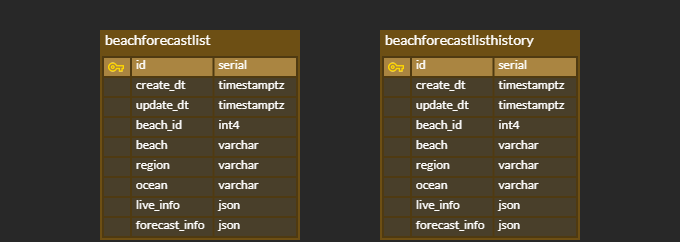

# Sea Forecast Service - Backend

:page_facing_up: Personal project / :date: 2021.10 - 2021.11 

원하는 해변의 기상 정보 조회를 제공하는 Sea Forecast Service의 Backend part입니다.

​    

## :bookmark: Demo link

* https://forecast-api-app.herokuapp.com/docs

​    

## :bookmark: Tech stack

* Python 3.9
* FastAPI 0.7
* PostgreSQL 13
* Alembic 1.7
* Heroku 

​    

## :bookmark: ERD

최근 기상 정보만을 저장하는 table과 기상 정보 history를 저장하는 table을 만들고, DB에서 각각 데이터를 관리하도록 구현했습니다.

​    

## :bookmark: Core features

### :paperclip: API

- `read_beach_forecast_list` :pushpin: [코드 확인](https://github.com/veluminous/sea_forecast_api/blob/bdd2df507f0e636f73047c63159eae20e57e4bd8/app/api/api_v1/endpoints/forecast.py#L15)
  - 해변에 대한 검색어와 바다 이름을 query로 받아, query에 해당하는 전체 해변들의 기상 실황 정보를 조회하는 API입니다.
  - 해변 검색어는 문자열을 자유롭게 입력하여 검색합니다.
  - 바다의 경우 '동해', '서해', '남해', '제주' 중 하나를 명확히 입력해야 검색이 가능 합니다.
- `read_beach_forecast_detail` :pushpin: [코드 확인](https://github.com/veluminous/sea_forecast_api/blob/bdd2df507f0e636f73047c63159eae20e57e4bd8/app/api/api_v1/endpoints/forecast.py#L29)
  - 하나의 특정 해변의 자세한 기상 실황 및 예보 정보를 조회하는 API입니다.
  - `beach_id`를 통해 해당 해변 정보를 조회합니다.

​    

### :paperclip: Dependency

* `get_db` :pushpin: [코드 확인](https://github.com/veluminous/sea_forecast_api/blob/bdd2df507f0e636f73047c63159eae20e57e4bd8/app/api/deps.py#L6)
  * DB session을 열어 DB 작업이 필요한 API에 잠시 넘겨주고, 작업이 끝나면 다시 session을 돌려받아 닫습니다.

​    

### :paperclip: ETC

* 보안이 필요하거나 변경을 용이하게 할 정보는 환경변수에 저장해 사용했습니다. (DB information, Project name) :pushpin: [코드 확인](https://github.com/veluminous/sea_forecast_api/blob/bdd2df507f0e636f73047c63159eae20e57e4bd8/app/core/config.py#L7)

​    